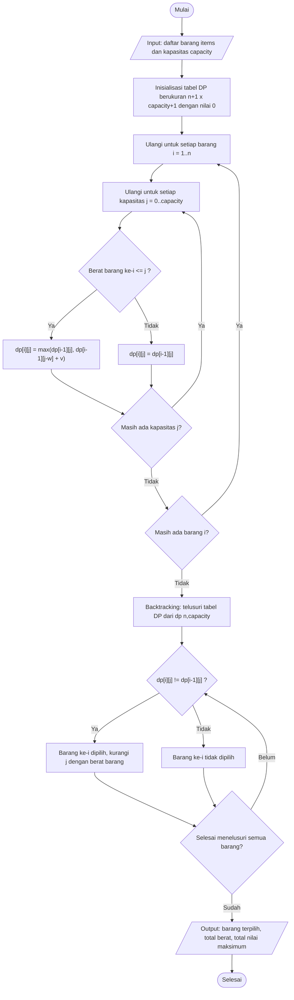

# BAB III

# PERANCANGAN

## 3.1 Flowchart Algoritma

*[Sisipkan gambar flowchart algoritma di sini.]*

> Diagram berikut dapat digunakan sebagai acuan pembuatan gambar flowchart (format Mermaid):



Flowchart di atas menggambarkan alur kerja algoritma **Dynamic Programming (DP) 0/1 Knapsack** mulai dari penerimaan input hingga menghasilkan output. Alur yang tergambar adalah sebagai berikut:

1. **Input** — Program menerima daftar barang (masing-masing memiliki nama, berat, dan nilai) beserta kapasitas maksimum tas.
2. **Inisialisasi tabel DP** — Dibuat tabel berukuran `(n+1) x (capacity+1)` yang seluruh selnya diinisialisasi dengan nilai 0.
3. **Pengisian tabel** — Untuk setiap barang dan setiap kemungkinan kapasitas, program memilih nilai maksimum antara **tidak mengambil** barang (`dp[i-1][j]`) atau **mengambil** barang tersebut (`dp[i-1][j-w] + v`), selama berat barang tidak melebihi kapasitas saat ini.
4. **Backtracking** — Setelah tabel terisi penuh, program menelusuri balik dari sel `dp[n][capacity]` untuk menentukan barang mana saja yang benar-benar dipilih.
5. **Output** — Program mengembalikan daftar barang terpilih, total berat, dan total nilai maksimum yang dapat dimuat dalam tas.

---

## 3.2 Rancangan Antarmuka Web

*[Sisipkan gambar wireframe atau mockup antarmuka web di sini.]*

> Wireframe acuan tata letak antarmuka:

```
+-------------------------------------------------------------------+
|                     KNAPSACK SOLVER                               |
+----------------------+--------------------------------------------+
|   AREA INPUT         |        AREA VISUALISASI                    |
|  (Sidebar)           |       (Simulation Area)                    |
|                      |                                            |
|  Kapasitas: [____]   |   +------------------------------------+   |
|                      |   |   Tabel DP (animasi step-by-step)  |   |
|  Daftar Barang:      |   |   [ ][ ][ ][ ][ ]                  |   |
|   - Laptop  3kg/4    |   |   [ ][x][ ][ ][ ]  <- langkah aktif|   |
|   - Buku    1kg/2    |   |   [ ][ ][ ][ ][ ]                  |   |
|   - Kamera  2kg/3    |   +------------------------------------+   |
|   [+ Tambah Barang]  |                                            |
|                      |   << Prev |  Step 4/12  | Next >>          |
|                      |       (Tombol Kontrol / Stepper)           |
+----------------------+--------------------------------------------+
|              AREA OUTPUT (Selected Panel)                         |
|   Barang terpilih: Laptop, Kamera                                 |
|   Total Berat: 4 kg   |   Total Nilai: 6                          |
+-------------------------------------------------------------------+
```

Rancangan antarmuka web terdiri dari beberapa komponen utama, yaitu:

- **Area input** — Pengguna memasukkan data yang akan diproses algoritma (kapasitas tas serta daftar barang beserta berat dan nilainya). *(Komponen: `Sidebar.tsx`)*
- **Tombol kontrol** — Tombol untuk memulai, melangkah maju/mundur (next/prev), dan mereset proses simulasi algoritma. *(Komponen: `Stepper.tsx`)*
- **Area visualisasi** — Menampilkan proses kerja algoritma secara animasi *step-by-step*, termasuk pengisian tabel DP sel demi sel. *(Komponen: `SimulationArea.tsx`, `DPTable.tsx`)*
- **Area output** — Menampilkan hasil akhir dari proses algoritma berupa barang yang terpilih, total berat, dan total nilai maksimum. *(Komponen: `SelectedPanel.tsx`)*

---

## 3.3 Struktur Proyek

Proyek terbagi menjadi dua bagian: **Backend** (FastAPI/Python) yang menjalankan algoritma dan menyediakan REST API, serta **Frontend** (Next.js/React/TypeScript) yang menyediakan antarmuka web dan visualisasi.

### Backend (`knapsack-solver-api`)

| Nama File | Keterangan |
|-----------|------------|
| `knapsack.py` | Logika inti algoritma 0/1 Knapsack (Dynamic Programming + backtracking) |
| `main.py` | Server REST API (FastAPI), endpoint `POST /solve`, konfigurasi CORS, dan validasi data (Pydantic) |
| `test_knapsack.py` | Unit & integration test menggunakan pytest |
| `requirements.txt` | Daftar dependensi/library Python |
| `Procfile` | Konfigurasi deployment (menjalankan server uvicorn) |
| `README.md` | Petunjuk instalasi dan penggunaan backend |
| `penjelasan.md` | Penjelasan rinci algoritma dan cara kerja |

### Frontend (Next.js — folder `src/`)

| Nama File | Keterangan |
|-----------|------------|
| `app/page.tsx` | Halaman utama web; orkestrasi state dan penghubung seluruh komponen |
| `app/layout.tsx` | Kerangka tata letak (layout) global aplikasi |
| `app/globals.css` | Styling global (Tailwind CSS) |
| `components/Sidebar.tsx` | Area input: form data barang dan kapasitas |
| `components/SimulationArea.tsx` | Area visualisasi proses algoritma |
| `components/DPTable.tsx` | Visualisasi tabel DP dengan animasi step-by-step |
| `components/Stepper.tsx` | Tombol kontrol navigasi langkah simulasi |
| `components/SelectedPanel.tsx` | Area output: hasil akhir (barang terpilih, total berat & nilai) |
| `components/ItemIcon.tsx` | Ikon visual untuk tiap barang |
| `components/ui/` | Kumpulan komponen UI reusable (`button`, `card`, `input`, `Select`) |
| `lib/api.ts` | Fungsi pemanggilan REST API ke backend |
| `lib/utils.ts` | Fungsi utilitas pendukung |
| `types/index.ts` | Definisi tipe data (TypeScript) |
| `package.json` | Daftar dependensi dan skrip proyek frontend |
